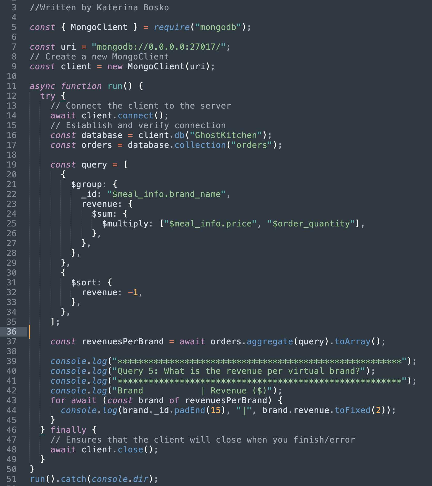

# GhostKitchen-II
**Team:** Katerina Bosko, Jiayi Li

In this project, we implement a database for a restaurant chain "Golden triangle" which has 5 locations across several U.S. states. The company wants to try out the new business model - ghost kitchen - meaning that the restaurants can create "virtual brands" without providing in-dining options and customers order the new menu items for takeout, drive-through and delivery only. The advantages of this model is that the restaurants can save costs, experiment with new menus and create in-house analytics.

**GhostKitchen-II** is the continuation of our project ["GhostKitchen"](https://github.com/Jiayi-Emily-Li/GhostKitchen) that was implemented using Express framework for Node.js, SQLite and Bootstrap.

Here we migrated SQL database into **MongoDB** and rewrote the queries using MQL - Mongo's query language. 

See [GhostKitchen-III](https://github.com/k-bosko/GhostKitchen-III) for implementation of the same app using **Redis** 

## App


Using the app:

1) Clone the repo and cd into `GhostKitchen-II/GhostKitchen-II/` (where the app is)
2) Install the dependencies

```
npm install
```

3) Start the server

```
npm start
```

4) Start MongoDB instance in your local machine
Assuming that you have MongoDB installed, you can do it on MacOS by running

```
brew services start mongodb-community
```

To install MongoDB on MacOS run:
```
brew install mongodb-community
```

5) Import database into your MongoDB local instance by running 

```
npm run initializeDB
```

6) Point your browser to http://locahost:3000

*Notes:* 

You can download dump of the database from `./GhostKitchen-II/db/dump`

You can also run the script that migrates data from SQLite to JSON (`./GhostKitchen-II/db/migration_SQLtoMongolike/1_SQLtoMongo.py`) like so:
```
npm run migrate
```

## Database Design

To create a MongoDB database, we went through the whole database creation cycle:

1. Analyzing business requirements
2. Conceptual modeling
3. Logical modeling using hierarchical tables
4. Migrating from SQL format to JSON format 
5. Importing JSON files in MongoDB
6. Rewriting the queries using MQL

We also run several MQL queries that could be of potential interest to "Golden Triangle":
- How many customers ordered burgers on Doordash?
- How many orders are takeouts in California?
- What are the top 5 users that left the largest number of ratings?
- What is the revenue per virtual brand?
- Example of update query

To run the above queries, start the queries script after downloading the app and installing the depencies like so:
```
npm run queries
```

### Conceptual Model


### Hierarchical Table


### JSON Examples


### Query Example


# Work Distribution
Jiayi Li worked on creating the Admin page and CRUD Meals and Orders collections.

Katerina Bosko worked on creating th User page and CRUD Customers, Locations, Orders and Ratings collections.

# Acknowledgement
The data for customers collection was generated using [ https://www.mockaroo.com/](https://www.mockaroo.com/)

This is a project for a Database Management Systems class at Northeastern University (Silicon Valley campus) taught by [John Alexis Guerra Gómez](https://github.com/john-guerra)
